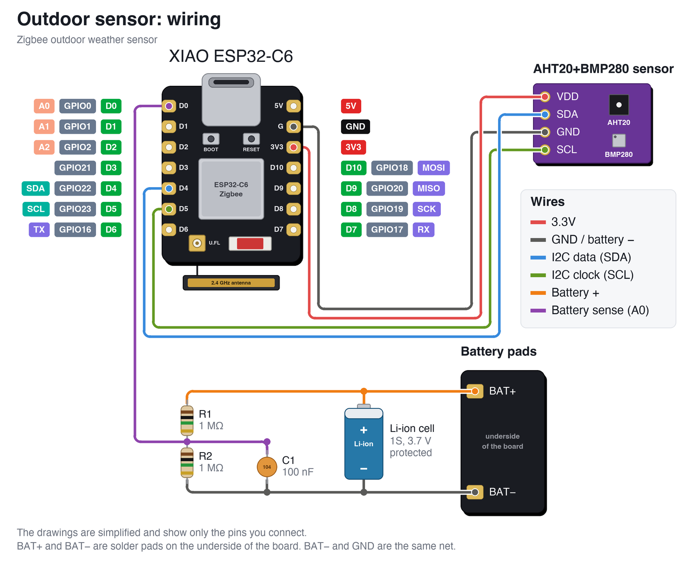
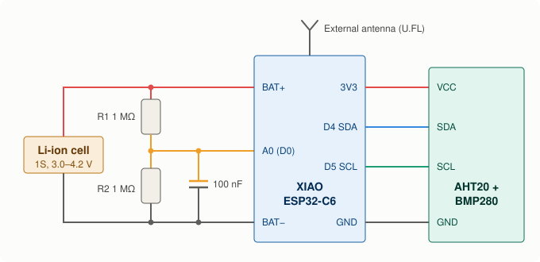

# Zigbee outdoor weather sensor

[](https://github.com/gaborgoncz/zigbee-outdoor-weather-sensor/actions/workflows/compile.yml)
[](https://buymeacoffee.com/gaborgoncz)

A battery powered outdoor sensor built on the **Seeed Studio XIAO ESP32-C6**. It measures temperature, humidity and air pressure, reports them over **Zigbee** to Home Assistant through Zigbee2MQTT, and spends the rest of its life in deep sleep.

How often it wakes up, and how it behaves on a low battery, is set from Home Assistant with sliders. No reflashing needed.

> **Status:** tested on hardware: a XIAO ESP32-C6 paired with Zigbee2MQTT through the external converter, reporting to Home Assistant, with the settings changed from there, including an overnight run on USB power. A normal report keeps the device awake for about 0.9 seconds. The firmware is compiled on every push (arduino-esp32 3.3.11). Battery life over a full charge has not been measured yet.

## Features

- Temperature and humidity from an **AHT20**, pressure from a **BMP280** (0.1 hPa resolution)
- Battery level and battery voltage
- Deep sleep between measurements, awake for about a second per report
- **External antenna** on the U.FL connector (switchable in the sketch)
- Dew point, absolute humidity and sea level pressure, calculated in Zigbee2MQTT
- Seven settings exposed to Home Assistant as number entities
- Optional **report on change**: the radio stays off while the weather is not changing
- Reports a failed sensor instead of going quiet
- Automatic longer sleep when the battery runs low
- Radio stays off entirely when the cell is nearly empty
- Backs off when the Zigbee network is unreachable instead of draining the battery

## What shows up in Home Assistant

| Entity | Kind | Notes |
|---|---|---|
| Temperature | sensor | °C |
| Humidity | sensor | % |
| Pressure | sensor | hPa, station pressure, or sea level pressure once an altitude is set |
| Dew point | sensor | °C, calculated |
| Absolute humidity | sensor | g/m³, calculated |
| Battery | sensor | %. Sent when it changes by 2 %, and once an hour |
| Voltage | sensor | mV. Sent together with the battery level |
| Active interval | diagnostic | interval the device is using right now. Sent when it changes, and once an hour |
| Sensor status | diagnostic | `ok`, or which sensor failed to read. Sent when it changes, and once an hour |
| Low battery mode | diagnostic | on while the low battery interval is in use |
| Awake time | diagnostic | ms the device was awake for the report before this one. Sent when it changes by more than a fifth, and once an hour. 0 after a power-on or reset |
| Join time, Report time, Sync time | diagnostic | ms of that awake time spent rejoining, reporting, and waiting for the settings answer. Sent with the awake time |
| Report interval | setting | 1–240 min, default 10. How often the device measures |
| Low battery threshold | setting | 5–80 %, default 25 |
| Low battery interval | setting | 5–720 min, default 60 |
| Temperature change | setting | 0–5 °C, default 0. See below |
| Humidity change | setting | 0–20 %, default 3. 0 ignores humidity |
| Pressure change | setting | 0–10 hPa, default 1. 0 ignores pressure |
| Max silent interval | setting | 10–1440 min, default 60 |

The device is asleep almost all the time, so a changed setting is **applied on its next report**. Zigbee2MQTT holds the new value until then. Pressing the reset button on the board applies it straight away.

### Report on change

With **Temperature change** at 0 every measurement is sent. Set it above 0 and the device still measures at every report interval, but only starts the radio when one of these is true:

- the temperature has changed by that much since the last report
- the humidity has changed by **Humidity change**, or the pressure by **Pressure change**
- a sensor has failed or recovered, or low battery mode has changed
- **Max silent interval** has passed since the last report

A wake-up without the radio takes a fraction of the energy of one with it, so a short report interval with a change of 0.2–0.5 °C gives quick updates when the weather moves and long battery life when it does not. The price: a changed setting waits for the next report, which can be as long as the max silent interval.

## Parts

- Seeed Studio XIAO ESP32-C6
- AHT20 + BMP280 combo module (I2C)
- Single Li-ion or LiPo cell (1S, 3.7 V nominal) **with protection circuit**
- 2.4 GHz antenna with U.FL connector
- 2 × 1 MΩ resistor and 1 × 100 nF capacitor for battery sensing

## Wiring



The same as a schematic:



| XIAO ESP32-C6 | Connects to |
|---|---|
| BAT+ (pad on the underside) | Cell positive, top of R1 |
| BAT− (pad on the underside) | Cell negative, bottom of R2, capacitor |
| A0 (D0) | Middle of the R1/R2 divider, capacitor |
| 3V3 | Sensor VCC |
| GND | Sensor GND |
| D4 (SDA) | Sensor SDA |
| D5 (SCL) | Sensor SCL |
| U.FL | External antenna |

Notes:

- The drawings are simplified. Follow the pin names printed on your own board and module.
- The wiring picture is drawn by [`docs/make_wiring.py`](docs/make_wiring.py).
- BAT− and GND are the same net.
- The XIAO has no built-in battery measurement, which is what the divider is for. Without it the device reports 0 % and skips all battery logic.
- One cell only. Cells in parallel are fine, two in series will destroy the board.
- The firmware cutoff only stops the radio. It does not disconnect the cell, so use a protected cell or a small BMS board.

## Flashing

Requires the Arduino IDE or `arduino-cli` with the **esp32** board package 3.3 or newer, plus the libraries *Adafruit AHTX0* and *Adafruit BMP280*.

Board settings:

| Setting | Value |
|---|---|
| Board | XIAO_ESP32C6 |
| Zigbee mode | Zigbee ED (end device) |
| Partition scheme | Zigbee 4MB with spiffs |
| Erase all flash before upload | Enabled, first upload only |

With `arduino-cli`:

```bash
arduino-cli compile --fqbn "esp32:esp32:XIAO_ESP32C6:PartitionScheme=zigbee,ZigbeeMode=ed" xiao_c6_outdoor_sensor
```

```bash
arduino-cli upload --fqbn "esp32:esp32:XIAO_ESP32C6:PartitionScheme=zigbee,ZigbeeMode=ed" -p <port> xiao_c6_outdoor_sensor
```

Once the device deep sleeps, its USB port disappears. To flash again, hold **BOOT** while plugging in the cable.

## Zigbee2MQTT setup

1. In the Zigbee2MQTT UI open **Settings → Dev console → External converters**.
2. Create `xiao_c6_outdoor.mjs` and paste the contents of [`z2m/xiao_c6_outdoor.mjs`](z2m/xiao_c6_outdoor.mjs).
3. Save and restart Zigbee2MQTT.
4. Enable **Permit join**, then power the board.

To report sea level pressure, open the device in Zigbee2MQTT, go to **Settings (specific)** and enter the **altitude** of the sensor in metres. At 0 the station pressure is reported.

A device that has not been paired yet stays awake for **2 minutes** with the LED blinking once it has joined, so Zigbee2MQTT can interview and configure it. After that it remembers that it is paired: a reset or a battery swap only triggers a normal measurement and it goes back to sleep.

To open the 2 minute window again on a paired device, press **reset**, then right away press and hold **BOOT** until the LED starts blinking, and release it. Do not hold BOOT while pressing reset, that starts the bootloader instead. Holding **BOOT** for 3 seconds while the window is open makes the device leave the network so it can be paired again.

### Updating from an older version

Newer firmware adds a Zigbee endpoint and new readings. The Zigbee data stored on the board by the older firmware does not know them, and the device restarts in a loop when it tries to report them. So an update is a fresh start:

1. Replace the converter in Zigbee2MQTT and restart it.
2. Remove the device in Zigbee2MQTT.
3. Flash the firmware with **Erase all flash before upload** enabled (`EraseFlash=all` in the FQBN for `arduino-cli`). Together with step 2 this resets the settings to their defaults, so set them again after pairing.
4. Enable **Permit join** and press reset on the board.

## Configuration in the sketch

The values at the top of [`xiao_c6_outdoor_sensor.ino`](xiao_c6_outdoor_sensor/xiao_c6_outdoor_sensor.ino):

| Define | Default | Purpose |
|---|---|---|
| `DEBUG_LOG` | `0` | Set to `1` for USB serial logging on the bench |
| `USE_EXTERNAL_ANTENNA` | `1` | `0` uses the on-board ceramic antenna |
| `BATTERY_DIVIDER_RATIO` | `2.0` | (R1 + R2) / R2 |
| `BATTERY_CAL` | `1.0` | Multimeter voltage divided by reported voltage |
| `BATTERY_CUTOFF_MV` | `3300` | Below this the radio stays off |
| `CONFIG_WINDOW_MS` | `700` | Longest wait for Zigbee2MQTT to answer the settings checksum |
| `SLOW_REPORT_MIN` | `60` | How often battery, status, active interval and awake time are sent when they do not change |

## How it works

Every wake-up is a fresh boot that runs once and ends in deep sleep:

1. Read the battery. If the cell is nearly empty, sleep for 6 hours without starting the radio. A press of the reset button skips this once, so the device can still be reached on a weak cell.
2. Read the sensors while the radio is still off.
3. With a temperature change set: if nothing has changed enough since the last report, go back to sleep here, without the radio.
4. Start Zigbee and rejoin the network.
5. Report temperature, humidity, pressure and a checksum of the settings. Battery, voltage, status and active interval are added when they have changed, and once an hour. The awake time and its stages are added when they have changed by more than a fifth.
6. Wait for Zigbee2MQTT to answer the checksum. If Home Assistant's settings give the same checksum, the answer is a single "nothing to change", normally within a fraction of a second. If not, Zigbee2MQTT writes the settings first, and the device stores them in flash. If no answer comes, it gives up after 0.7 seconds. The device does not wait for the coordinator to confirm each report: those confirmations go missing now and then although the reports arrive, and waiting for them more than doubled the awake time.
7. Deep sleep for the report interval, or for the low battery interval while the battery is at or below the threshold.

Low battery mode ends once the battery is 5 % above the threshold again. If the network cannot be joined, the sleep time doubles after every failed attempt, up to 16 times the interval and never more than 12 hours. A report that gets nothing back from the coordinator is taken as delivered, because that happens now and then although the report did arrive; only the third in a row counts as a failed attempt as well.

### Zigbee endpoints

| Endpoint | Content |
|---|---|
| 10 | Temperature, humidity, battery percentage |
| 11 | Temperature change (analog output), pressure (analog input) |
| 12 | Report interval (analog output), battery voltage (analog input) |
| 13 | Low battery threshold (analog output), interval in effect (analog input) |
| 14 | Low battery interval (analog output), awake time (analog input) |
| 15 | Max silent interval (analog output), device status (analog input) |
| 16 | Humidity change (analog output), stage times of the last report (analog input) |
| 17 | Pressure change (analog output) |
| 18 | Settings sync (analog output): checksum from the device, answer from Zigbee2MQTT |

The device status is a bit field: 1 = AHT20 failed, 2 = BMP280 failed, 4 = low battery mode. The converter turns it into the sensor status and low battery mode entities.

## Things to know

- **Cold weather:** a Li-ion cell's voltage sags below 0 °C, so the battery percentage dips on cold nights. Lower the threshold if low battery mode kicks in too early.
- **Charging:** the XIAO charges the cell whenever USB is connected. Li-ion should not be charged below 0 °C.
- **Calibration:** compare the reported voltage with a multimeter and adjust `BATTERY_CAL`.
- **Routers in between:** in testing, with the device attached through an Espressif range extender instead of directly to the coordinator, about half of the coordinator's answers did not reach it. Reports still arrived, but those wake-ups took 1.3 s instead of 0.9 s and settings were handed over late. If Awake time jumps between two values, check which router the device is attached to.
- **Firmware and converter belong together:** the device sleeps as soon as the converter has answered its settings checksum, and both must calculate that checksum the same way. With a converter from another version the device waits the full `CONFIG_WINDOW_MS` on every report, or has all settings written on every report.
- **Home Assistant decides the settings:** the values in Zigbee2MQTT are written to the device whenever they differ. Removing the device in Zigbee2MQTT deletes those values; the device then reports its own, and after a flash erase those are the defaults again.

## Support

If this project is useful to you, you can [buy me a coffee](https://buymeacoffee.com/gaborgoncz).
